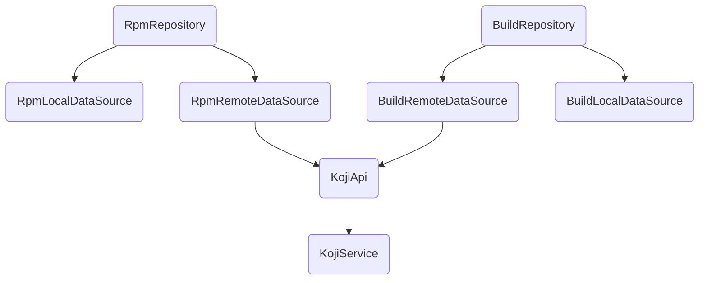

Data Layer Architecture
-----------------------

```mermaid
flowchart TD
    %% nodes
    KojiService(KojiService)
    KojiApi(KojiApi)

    RpmRemoteDataSource(RpmRemoteDataSource)
    BuildRemoteDataSource(BuildRemoteDataSource)

    RpmLocalDataSource(RpmLocalDataSource)
    BuildLocalDataSource(BuildLocalDataSource)

    RpmRepository(RpmRepository)
    BuildRepository(BuildRepository)

    %% edges
    KojiApi --> KojiService

    RpmRemoteDataSource --> KojiApi
    BuildRemoteDataSource --> KojiApi
    RpmRepository --> RpmLocalDataSource
    RpmRepository --> RpmRemoteDataSource
    BuildRepository --> BuildRemoteDataSource
    BuildRepository --> BuildLocalDataSource
```
